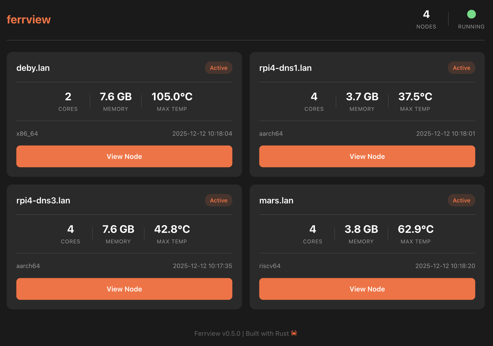
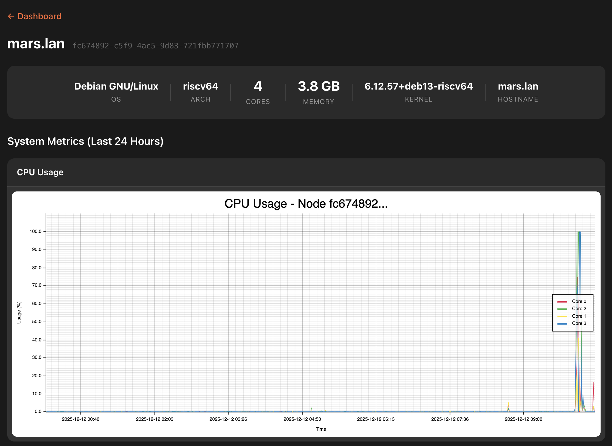

# Ferrview

A lightweight system monitoring tool written in Rust.

## Overview

Ferrview is a modular system monitoring utility with a client-server architecture:

- **ferrview-node**: Agent that runs on each monitored machine, collecting system metrics via configurable probes
- **ferrview-collector**: Central server that receives metrics from nodes, stores time-series data, and provides a web dashboard

The node agent uses the `sysinfo` crate to gather comprehensive system data and sends it to the collector via HTTP.

## Web UI

Ferrview includes a web dashboard for visualizing metrics from all monitored nodes.

### Dashboard



### Node Detail



## Features

- **CPU Monitoring**: Core count, frequency, and individual core information
- **Memory Analysis**: RAM usage, swap usage, and percentage calculations
- **Temperature Sensing**: Hardware temperature readings with critical thresholds
- **Disk Monitoring**: Disk usage and capacity per mount point
- **Network Monitoring**: Interface traffic statistics (bytes sent/received)
- **Process Monitoring**: Fork rate tracking via /proc/stat (Linux)
- **Configurable Probes**: Enable/disable specific monitoring modules via TOML configuration
- **Structured Logging**: JSON-formatted output with timestamps for easy parsing
- **Lightweight**: Minimal dependencies and optimized binary size

## Installation

### Prerequisites

- Rust toolchain (stable edition 2024 or later)
- Cargo package manager

### Building from Source

```bash
# Clone the repository
git clone <repository-url>
cd ferrview

# Build the project
cargo build --release

# Binaries will be available at:
# - target/release/ferrview-node
# - target/release/ferrview-collector
```

## Configuration

### ferrview-node

The node agent uses `ferrview-node.toml` to configure probes and collector address:

```toml
node_id = "uuid or similar (string)"
metrics_collector_addr = "hostname:port (ip address is ok too)"

[probes.sysinfo]
static_info = true   # System static information
cpu = true           # CPU core information
memory = true        # RAM and swap usage
disk = true          # Disk information
network = true       # Network interface data
temperature = true   # Hardware temperature sensors

[probes.procfs]
forks = true         # Process creation monitoring (Linux only)
```

### ferrview-collector

The collector is configured via command-line arguments:

```bash
ferrview-collector -l 0.0.0.0 -p 8080 -d /path/to/data/
```

- `-l`: Listen address (default: 0.0.0.0)
- `-p`: Port (default: 8080)
- `-d`: Data directory for SQLite databases

## Usage

### Running the Collector

Start the collector server first (typically on a central machine):

```bash
ferrview-collector -l 0.0.0.0 -p 8080 -d ./data/

# Or using cargo
cargo run -p ferrview-collector -- -l 0.0.0.0 -p 8080 -d ./data/
```

The web dashboard will be available at `http://localhost:8080`.

### Running the Node Agent

Run the node agent on each machine you want to monitor:

```bash
ferrview-node --config-file /path/to/ferrview-node.toml

# Or using cargo
cargo run -p ferrview-node -- --config-file ferrview-node/ferrview-node.toml
```

### Example Output

The node agent outputs structured logs with UTC timestamps:

```
2024-01-01T12:00:00Z INFO Starting ferrview-node
2024-01-01T12:00:00Z INFO Starting CPU probe
2024-01-01T12:00:00Z INFO Detected 8 CPU cores
2024-01-01T12:00:00Z INFO Memory information total_memory_bytes=17179869184 used_memory_bytes=8589934592 memory_usage_percent="50.0"
```

## Project Structure

```
ferrview/
├── ferrview-common/      # Shared library and data structures
│   └── src/lib.rs
├── ferrview-node/        # Node agent
│   ├── src/
│   │   ├── main.rs          # Main entry point
│   │   ├── client/          # HTTP client for sending metrics
│   │   ├── probes/          # Monitoring probes
│   │   │   ├── sysinfo/     # System information probes
│   │   │   │   ├── cpu.rs    # CPU monitoring
│   │   │   │   ├── mem.rs    # Memory monitoring
│   │   │   │   ├── disk.rs   # Disk monitoring
│   │   │   │   ├── network.rs # Network monitoring
│   │   │   │   ├── temp.rs   # Temperature monitoring
│   │   │   │   └── statik.rs # Static system info
│   │   │   └── procfs/      # Linux /proc filesystem probes
│   │   │       └── forks.rs  # Process fork monitoring
│   │   ├── config.rs        # Configuration loading
│   │   └── utils/           # Utility functions
│   └── ferrview-node.toml # Example configuration
├── ferrview-collector/   # Collector server
│   ├── src/
│   │   ├── main.rs          # Main entry point
│   │   ├── http/            # HTTP server and API
│   │   ├── store/           # Data storage
│   │   └── charts/          # Chart rendering
│   └── ferrview-collector.toml # Example configuration
├── Cargo.toml              # Workspace configuration
└── README.md               # Project documentation
```

## Dependencies

- `sysinfo`: System information gathering
- `serde`: Configuration serialization/deserialization
- `toml`: Configuration file parsing
- `tracing`: Structured logging framework
- `time`: Timestamp formatting

## Development

This project uses [mise](https://mise.jdx.dev/) for task management.

### Available Tasks

```
mise tasks --all

build-rust-dev      [DEV] cargo build
build-rust-release  [RELEASE] cargo build --release
check               Cargo check
lint                Lint with Clippy, failing on warnings
```

### Building for Development

```bash
mise run build-rust-dev
```

### Building for Release

```bash
mise run build-rust-release
```

### Type Checking

```bash
mise run check
```

### Linting

```bash
mise run lint
```

### Running Tests

```bash
cargo test
```

### Code Formatting

```bash
cargo fmt
```

## Performance

The release build is optimized for minimal binary size with:

- Thin LTO (Link Time Optimization)
- Panic abort for smaller binaries
- Symbol stripping with separate debug info
- Single codegen unit for optimal optimization

## Extending Ferrview

### Adding New Probes

1. Create a new module in `ferrview-node/src/probes/`
2. Implement probe functions following the existing pattern
3. Add configuration options in `ferrview-node/src/config.rs`
4. Register the probe in the main execution flow

### Example Probe Structure

```rust
pub fn probe_example(sys: &System) {
    use tracing::info;
    info!("Starting example probe");
    // Probe implementation
}
```

## License

Ferrview is licensed under the GNU Affero General Public License v3.0 (AGPL-3.0). See the [LICENSE](LICENSE) file for details.

## Contributing

Contributions are welcome! Please feel free to submit pull requests or open issues for:

- New probe implementations
- Configuration enhancements
- Performance improvements
- Documentation updates

## Roadmap

### Node Agent

- [x] Disk usage monitoring ✓
- [x] Network interface statistics ✓
- [x] Process monitoring (forks) ✓
- [ ] GPU information (where available)
- [ ] Battery status (for laptops)

### Collector

- [x] Collector HTTP API ✓
- [x] Storing metrics as time series ✓
- [x] Basic web dashboard with charting ✓
- [ ] Advanced query interface
- [ ] Data aggregation and rollups
- [ ] Alerting and notifications
- [ ] Cloud backup functionality

## Support

For issues, questions, or feature requests, please open an issue on the project repository.
